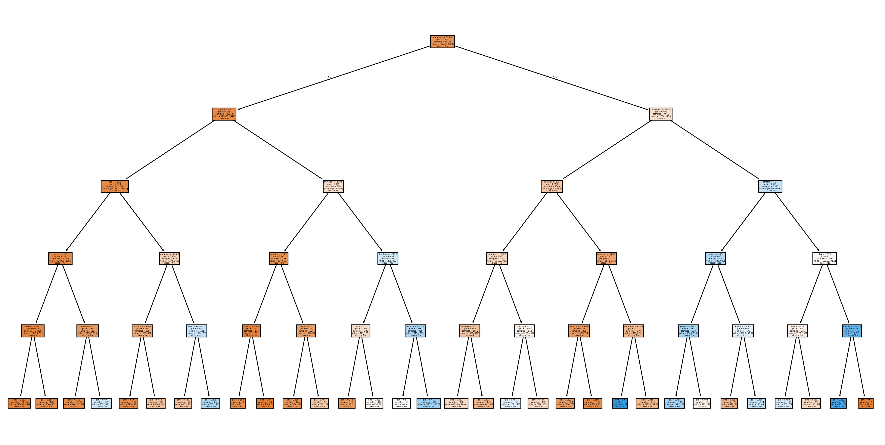

# SCT_DS_3
# Decision Tree Classifier - Bank Marketing Dataset

## Task 3: Decision Tree Classifier

### Objective

Build a Decision Tree Classifier to predict whether a customer will subscribe to a term deposit based on demographic and marketing campaign data.

### Dataset

The Bank Marketing Dataset contains information about customers and their responses to direct marketing campaigns conducted by a banking institution.

### Technologies Used

* Python
* Pandas
* NumPy
* Scikit-learn
* Matplotlib

### Project Workflow

#### 1. Data Loading

* Loaded the Bank Marketing dataset.
* Explored dataset structure and features.

#### 2. Data Preprocessing

* Checked for missing values.
* Converted categorical variables into numerical values using Label Encoding.

#### 3. Data Splitting

* Split the dataset into training and testing sets using an 80:20 ratio.

#### 4. Model Building

* Trained a Decision Tree Classifier using Scikit-learn.

#### 5. Model Evaluation

* Calculated Accuracy Score.
* Generated Classification Report.
* Generated Confusion Matrix.

#### 6. Visualization

* Visualized the Decision Tree structure.
* Saved the Decision Tree plot and Confusion Matrix as images.

### Results

The Decision Tree model was successfully trained and evaluated on the Bank Marketing dataset. The model was able to classify customers based on their likelihood of subscribing to a term deposit.

### Files Included

* Task3_DecisionTree.ipynb
* decision_tree.png
* confusion_matrix.png
* README.md

### Learning Outcomes

* Data preprocessing techniques
* Feature encoding
* Decision Tree Classification
* Model evaluation metrics
* Tree visualization using Scikit-learn

  ## Decision Tree Visualization

